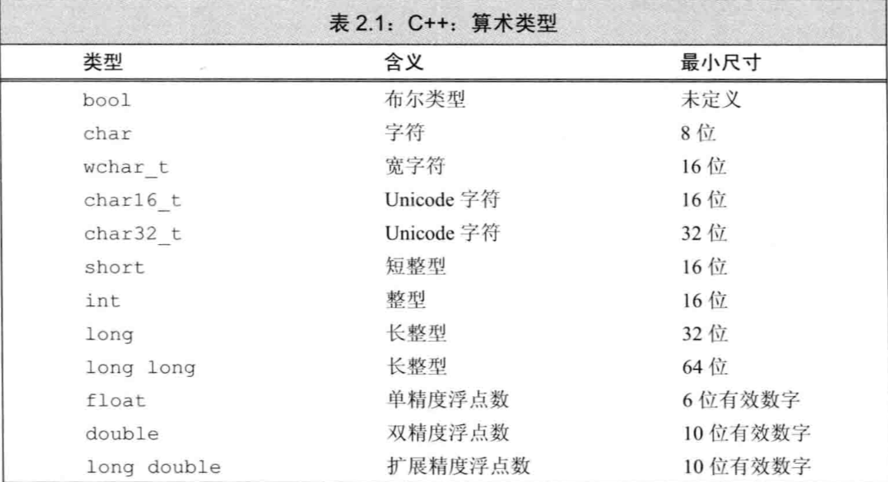
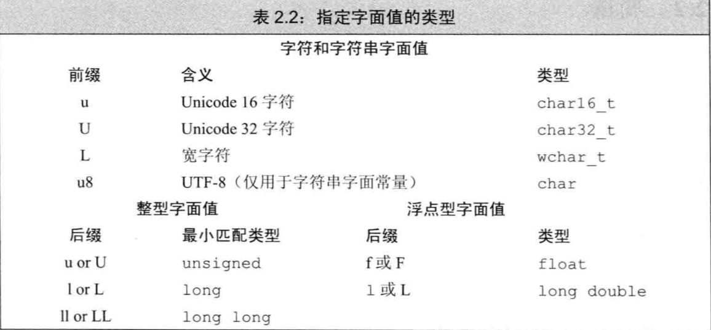

# 第2章 变量和基本类型

## 2.1基本内置类型

C++定义了一套包括算术类型和空类型在内的基本数据类型。


### 2.1.1 算术类型

算术类型分为两类：`整型`和`浮点型`。 算术类型的尺寸在不同机器上有所差别。下表中列出了C++标准规定的尺寸的最小值，同时允许编译器赋予这些类型更大的尺寸。




除了布尔类型，其他整型可以划分为**带符号的**和**无符号的**两种。带符号类型可以表示正数、负数或0，无符号类型仅能表示**大于等于**0的值。

类型int、short、long和long long都是带符号的，通过在这些类型名前添加unsigned就可以得到无符号类型。

字符型被分为三种：char、signed char和unsigned char。特别需要注意的是：类型char和类型signed char并不一样。尽管字符型有三种，但是字符的表现形式只有两种：带符号的和无符号的。类型char实际上会表现为上述两种形式的一种，具体是哪种由编译器决定。

### 2.1.2 类型转换

```cpp
int main()
{    
    bool b = 42;//b=true
    std::cout << "b=" << b<<std::endl;
    int i = b; //i=1
    i = 3.14; // i=3
    double pi = i; //pi = 3.0
    unsigned char c = -1; //假设char占8 byte，c的值为255
    signed char c2 = 256;//假设char占 8 byte，c的值是未定义的
    return 0;
}
```

* 当我们把非布尔值类型的算术值赋给布尔类型，初始值为0则结果为false，否则结果为true。
* 当我们把一个布尔值赋给非布尔类型时，初始值为false则结果为0，初始值为true则结果为1。
* 当把一个浮点数赋给整数类型时，结果值仅保留浮点数中小数点之前的部分。
* 当我们把一个整数值赋予给浮点类型时，小数部分记为0。如果该整数所占的空间超过了浮点类型的容量，精度可能有损失。
* 当我们赋给无符号类型一个超出它表示范围的值时，结果是初始值对无符号类型表示数值总数取模后的余数。例如，8比特大小的unsigned char可以表示0至255区间内的值，**表示的数值总数为256**，如果我们赋了一个区间以外的值-1，则结果为`-1%256=255`。

```cpp
#include <iostream>
int main()
{
    int result = -1%256; //-1
    std::cout<<result<<std::endl;
    unsigned char c = -1; //255
    std::cout<< c << std::endl;
}
```

> 注意：C++自身的取模运算采用的truncate处理方式，转型却采用的是`floor`除法。关于取模参考[这篇](https://www.jianshu.com/p/452c1a5acd31)文章。

* 当我们赋给带符号类型一个超出它表示范围的值时，结果为未定义的。此时，程序可能继续工作、可能崩溃，也可能产生垃圾数据。

#### 含有无符号类型的表达式

```cpp
unsigned u = 10;
int i = -42;
std::cout << i + i << std::endl;//-84
std::cout << i + u << std::endl;//4294967264
```

在第一个输出表达式里，两个负整数想家得到了期望的结果。在第二个输出表达式里，相加前首先把整数-42转换成无符号数然后与无符号数相加`-42%2^32+10=4294967264`。

当从无符号数中减去一个值时，不管这个值是不是无符号，我们都必须确保结果不能是一个负数。

```cpp
unsigned u1 = 42, u2 = 10;
std::cout << u2 - u1 << std::endl; //4294967264  32%2^32
```

### 2.1.4 字面值常量

#### 整型和浮点型字面值

可以将整型字面量写作十进制、八进制或十六进制。以0开头的代表八进制数，以0x或0X开头的代表十六进制。

```cpp
float f = 314159e-5;
float f1 = .001;
cout << f << endl; //3.14159
cout << f1 << endl; //0.001
```

#### 字符和字符串字面值

#### 转义序列

我们也可以使用泛化的转义序列，其形式是`\x`后紧跟1个或多个十六进制数字，或者`\`后紧跟1个、2个或3个八进制数字，其中数字部分表示的是字符对应的数值。假设使用的是`Latin-1`字符集，以下是一些示例：

```text
\115（字母M，8进制）\x4d(字符M，十六进制)
```

```cpp
int main()
{   
    cout << "Hi \x4dO\115!" << endl; // Hi MOM!
    cout << "\1234" << endl; // S4
    char16_t c = u'\u4F60';
    cout << c << endl; //20320
    cout << "\u4F60\u597D" << endl; //你好
    return 0;
}
```

如果反斜线后面跟着的八进制数字超过3个，只有前3个数字与`\`构成转移序列。例如，`"\1234"`表示2个字符，即八进制123对应的字符及字符4。相反`\x`要用到后面跟着的所有数字，例如，"\x1234"表示一个16位的字符，该字符由4个十六进制所对应的比特唯一确定。因为大多数机器的`char`型数据占8位，所以上面这个例子可能会报错。一般来说，超过8位的十六进制字符都是与表2.2中木偶个前缀作为开头的扩展字符集一起使用。

#### 指定字面值的类型

通过添加下表中所列的前缀和后缀，可以改变整型、浮点型和字符型字面值的默认类型。




#### 布尔字面值和指针字面值

## 2.2 变量

### 2.2.1 变量定义

#### 初始值

#### 列表初始化

#### 默认初始化

### 2.2.2 变量声明和定义的关系

### 2.2.3 标识符

#### 变量命名规范

### 2.2.4 名字的作用域

#### 嵌套的作用域

## 2.3 复合类型

**复合类型**是指基于其他类型定义的类型。我们将介绍两种：**引用**和**指针**。

### 2.3.1 引用

**引用**为对象起了另外一个名字，引用类型引用另外一种类型。通过将声明符写成&d的形式来定义引用类型，其中d是声明的变量名。 一般在初始化变量时，初始值会被拷贝到新建的对象中。然而定义引用时，程序把引用和它的初始值绑定在一起，而不是将初始值拷贝给引用。一旦初始化完成，**引用将和它的初始值对象一直绑定在一起。因为无法令引用重新绑定到另外一个对象，因此引用必须初始化。**

```cpp
int main()
{    
    int ival = 1024;
    int &refVal = ival;
    refVal = 2; //把2赋值给refVal指向的对象，此处即是赋值给ival
    std::cout << "ival=" << ival << std::endl;//ival=2
    int ii = refVal;
    return 0;
}
```

#### 引用的定义

引用只能绑定在对象上，而不能与字面值或某个表达式的计算结果绑定在一起。

```cpp
int &refVal = 10;//错误：引用类型的初始值必须是一个对象
double dval = 3.14;
int &refVal2 = dval;//错误：此处引用类型的初始值必须是int型对象
```

### 2.3.2 指针

`指针`是指向另外一种类型的复合类型。与引用类似，指针也实现了对其他对象的间接访问。然而指针与引用相比又有很多不同点。其一、指针本身就是一个对象，允许对指针复制和拷贝，而且在指针的生命周期内它可以先后指向几个不同的对象。其二，指针无需再定义时赋初值。与其他内置类型一样，在块作用于内定义指针如果没有被初始化，也将用用一个不确定的值。

#### 获取对象的地址

指针存放某个对象的地址，要想获取该地址，需要使用`取地址符（操作符&）`。

```cpp
int ival = 42;
int *p = &ival;//p存放变量ival的地址，p是指向变量ival的指针。
```

#### 指针值

#### 利用指针访问对象

如果指针指向了一个对象，则允许使用`解引用符（操作符*）`来访问该对象。

```cpp
int ival = 42;
int * p = &ival;
*p = 0;//由解引用符*得到指针p所指的对象，即可经由p为变量ival赋值
```

#### 空指针

`空指针（null pointer）`不指向任何对象，在试图使用一个指针之前代码可以首先检查他是否为空。

生成空指针的方法有三种：

* 使用字面值`nullptr`来初始化指针，也就是C++11新标准刚刚引入的一种方法。`nullptr`是一种特殊类型的字面值，它可以被转换成任意其他的指针类型。

```cpp
int *p1 = nullptr;
```

* 通过将指针初始化为字面值0来生成空指针。

```cpp
int *p2 = 0;
```

* 用一个名为NULL的**预处理变量**来给指针赋值，这个变量在头文件cstdlib中定义，它的值就是0。

```cpp
int *p3 = NULL;
```

#### 赋值和指针

#### 其他指针操作

#### void\*指针

### 2.3.3 理解复合类型的声明

#### 指向指针的指针

```cpp
#include <iostream>
int main()
{
    int ival = 1024;
    int *pi = &ival;
    int **ppi = &pi;
    std::cout << "The value of ival\n"
              << "direct value: " << ival <<"\n"
              << "indirect value: " << *pi <<"\n"
              << "doubly indirect value: " << **ppi << std::endl;

}
```

输出

```text
The value of ival
direct value: 1024
indirect value: 1024
doubly indirect value: 1024
```

#### 指向指针的引用

```cpp
#include <iostream>
int main()
{
    int i = 42;
    int *p;
    int *&r = p; //r是一个对指针p的引用
    r = &i; //r引用了一个指针，因此给r赋值&i就是令p指向i
    std::cout << "*p = "<< *p <<std::endl;
    *r = 24; //解引用r得到i，也就是p指向的对象，将i的值改为0
    std::cout << "i = "<< i <<std::endl;
}
```

```text
*p = 42
i = 24
```

要理解r的类型到底是什么，最简单的方法是从右向左阅读r的定义。离变量名最近的符号对变量的类型有最直接的影响，因此r是一个引用。声明符的其余部分用以确定r引用的类型是什么，此例中的符号\*说明r引用的是一个指针。最后声明的基本数据类型部分指出r引用的是一个int指针。

## 2.4 Const限定符

因为`const`对象一旦被创建后值就不能再改变，所以`const`对象必须初始化。一如既往，初始值可以是任意复杂的表达式：

```cpp
int get_size()
{
    return 10;
}
int main()
{   
    const int i = get_size();
    const int j = 42;
    cout << i << endl; //10
    // const int k; // 错误：k是一个未经初始化的常量
}
```

#### 初始化和const

与非`const`类型所能参与的操作相比，`const`类型的对象能完成其中大部分，但也不是所有的操作都适合。主要的限制就是只能在`const`类型的对象上执行不改变其内容的操作。例如，`const int`和普通的`int`一样都能参与算术运算，也都能转换成一个布尔值，等等。

在不改变`const`对象的操作中还有一种是初始化，如果利用一个对象去初始化另外一个对象，则它们是不是`const`都无关紧要：

```cpp
int i = 42;
const int ci = i; //正确：i的值被拷贝给了ci
int j = ci; //正确：ci的值被拷贝给了j
```

尽管`ci`是整数常量，但无论如何`ci`中的值还是一个整型数。`ci`的常量特征仅仅在执行改变`ci`的操作时才会发挥作用。当用`ci`去初始化`j`，根本无须在意`ci`是不是一个常量。拷贝一个对象的值并不会改变它，一旦拷贝完成，新的对象和原来的对象没什么关系了。

#### 默认情况下，Const对象仅在文件内有效

只在一个文件中定义`const`，而在其他多个文件中声明并使用它，解决的方法是，对于const变量不管是声明还是定义都添加`extern`关键字。这样只需定义一次就可以了。

### 2.4.1 const的引用

可以把引用绑定到`const`对象上，就像绑定到其他对象上一样，我们称之为`对常量的引用（reference to const）`。与普通引用不同，对常量的引用不能被用作修改它所绑定的对象：

```cpp
const int ci = 1024;
const int &r1 = ci; // 正确：引用及其对应的对象都是常量
r1 = 42; //错误：r1是对常量的引用
int &r2 = ci; //错误：试图让一个非常量引用指向一个常量对象
```

因为不允许直接为`ci`赋值，当然也就不能通过引用去改变`ci`。因此对`r2`的初始化时错误的。假设改初始化合法，则可以通过`r2`类改变它引用对象的值，这显然是不正确的。

#### 初始化和const的引用

2.3.1节提到，引用的类型必须与其所引用对象的类型一致，但是有两个例外，第一种例外情况就是初始化常量引用时允许用任意表达式作为初始值，只要该表达式的结果能转换成引用的类型即可。尤其，允许为一个常量引用绑定非常量的对象、字面值，甚至是个一般表达式：

```cpp
#include <iostream>
int main()
{
    int i = 42;
    const int &r1 = i;
    const int &r2 =42;
    const int &r3 = r1 * 2;
    // int &r4 = r1 * 2; //错误：r4是一个普通的非常量引用 等价于给引用赋值一个常量
    const int &ri = dval;
    std::cout << ri << std::endl; // 3
}
```

要想理解这种例外情况的原因，最简单的办法是弄清楚当一个常量引用被绑定到另外一种类型上时到底发生了什么：

```cpp
double dval = 3.14;
const int &ri = dval;
```

此处`ri`引用了一个`int`型的数。对`ri`的操作应该是整数运算，但`dval`却是一个双精度浮点数而非整数。因此为了确保让`ri`绑定一个整数，编译器把上述代码变成了如下形式：

```cpp
const int temp = dval; // 由双精度浮点数生成一个临时的整型常量
const int &ri = temp;// 让ri绑定这个临时量
```

在这种情况下，`ri`绑定了一个`临时量（temporary）`对象。所谓临时量对象就是当编译器需要一个空间来暂存表达式的求值结果时临时创建的一个未命名的对象。`C++`程序员常常把临时量对象简称为临时量。

#### 对const的引用可能引用一个并非const的对象

必须认识到，常用引用仅对引用可参与的操作做出了限定，对于引用的对象本身是不是一个常量未作限定。因为对象也可能是个非常量，所以允许通过其他途径改变它的值：

```cpp
#include <iostream>
int main()
{
    int i = 42;
    int &r1 = i;
    const int &r2 = i;
    std::cout << "r2=" << r2 << std::endl; // 42 
    r1 = 24;
    std::cout << "r2=" << r2 << std::endl; // 24
}
```

### 2.4.2 指针和const

与引用一样，也可以令指针指向常量或非常量。类似于常量引用，`指向常量的指针（pointer to const）`不能用于改变其所指对象的值。要想存放常量对象的地址，只能使用指向常量的指针：

```cpp
const double pi = 3.14; // pi是个常量，它的值不能
// double *ptr = &pi; //错误：ptr是一个谱
const double *cptr = &pi; //正确：cptr可以指向一个双精度常量
// *cptr = 42; // 错误：不能给*cptr赋值
```

2.3.2节提到，指针的类型必须与其所指对象的类型一致，但是有两个例外，第一种例外情况是允许另一个指向常量的指针指向一个非常量对象。

```cpp
double dval = 3.14;
cptr = &dval;
```

和常量引用一样，指向常量的指针也没有规定其所指的对象必须是一个常量。所谓指向常量的指针仅仅要求不能通过该指针改变对象的值，而没有规定那个对象的值不能通过其他途径改变。

#### const指针

指针是对象而引用不是，因此就像其他对象类型一样，允许把指针本身定为常量。`常量指针（const pointer）`必须初始化，而且一档初始化完成，则它的值（也就是存放在指针中的那个地址）就不能再改变了。把`*`放在`const`关键字之前用以说明指针是一个常量，这样的书写形式隐含着一层意味，即不变的是指针本身的值而非指向的那个值：

```cpp
int errNumb = 0;
int *const curErr = &errNumb; //curErr将一直指向errNumb
*curErr = 10;
cout << errNumb << endl; //10
const double pi = 3.14159;
const double *const pip = &pi; // pip是一个指向常量对象的常量指针
```

### 2.4.3 顶层const

如前所述，指针本身是一个对象，它又可以指向另外一个对象。因此，指针本身是不是常量以及指针所指的是不是一个常量就是两个相互独立的问题。用名词`顶层const（top-level const）`表示指针本身是常量，而用名词`底层const（low-level const)`表示指针所指的对象是一个常量。

更一般的，顶层`const`可以表示任意的对象是常量，这一点对任何数据类型都使用，如算术类型、类、指针等。底层`const`则与指针和引用等复合类型的基本类型部分有关。比较特殊的是，指针类型既可以用顶层`const`也可以用底层`const`，这一点与其他类型相比区别明显：

```cpp
int i = 0;
int *const p1 = &i; //不能改变p1的值，这是一个顶层const
const int ci = 42;  //不能改变ci的值，这是一个顶层const
const int *p2 = &ci; //允许改变p2的值，这是一个底层const
const int *const p3 = p2; //靠右的const是顶层const，靠左的是底层const
const int &r = ci; // 用于声明引用的const都是底层const
```

当执行对象的拷贝操作时，常量是顶层`const`还是底层`const`区别明显。其中，顶层`const`不受什么影响：

```cpp
i = ci;
p2 = p3;
```

另一方面，底层`const`的限制却不能忽视。当执行对象的拷贝操作时，拷入和拷出的对象必须具有相同的底层`const`资格，或者两个对象的数据类型必须能够转换。一般来说，非常量可以转换成常量，反之则不行：

### 2.4.4 constexpr和常量表达式

`常量表达式（const experssion）`是指值不会改变并且在编译过程就能得到计算结果的表达式。显然，字面值属于常量表达式，用常量表达式初始化的`const`对象也是常量表达式。

```cpp
int main()
{
    const int max_files = 20; //常量表达式
    const int limit = max_files + 1; //常量表达式
    int staff_size = 27; //初始值是一个字面常量，但数据类型只是一个普通的int而非const int不是常量表达式
    const int sz = get_size(); //sz本身是一个常量，但它的具体值直到运行时才能获取，所以不是常量表达式
}
```

#### constexpr变量

在一个复杂的系统中，很难分辨一个初始值到底是不是常量表达式。当然可以定义一个const变量并把它的初始值设为我们认为的某个常量表达式，但在实际使用时，尽管要求如此却常常发现初始值并非常量表达式的情况。可以这么说，在此种情况下，对象的定义和使用根本就是两回事儿。

`C++11`新标准规定，允许将变量声明为`constexpr`类型以便由编译器来验证变量的值是否是一个常量表达式，声明为`constexpr`的变量一定是一个常量，而且必须用常量表达式初始化。

```cpp
#include <iostream>
constexpr int size()
{
    return 10;
}
int main()
{
    constexpr int mf = 20;
    constexpr int limit = mf +1;
    constexpr int sz = size(); //size是constexpr函数
    std::cout << sz << std::endl; // 10
}
```

#### 字面值类型

#### 指针和constexpr

## 2.5处理类型

### 2.5.1 类型别名

### 2.5.2 auto类型说明符

编程时常常需要把表达式的值赋给变量，这就要求在声明变量的时候清楚地知道表达式的类型。然而要做到这一点并非那么容易，有时甚至根本做不到。为了解决这个问题，`C++11`新标准引入了`auto`类型说明符，用它就能让编译器替我们去分析表达式所属的类型。和原来那些只对应一种特定类型的说明符不同，`auto`让编译器通过初始值推算变量的类型。显然，auto定义的变量必须有初始值。

### 2.5.6 decltype类型指示符

有时会遇到这种情况：希望从表达式的类型推断出要定义的变量的类型，但是不想用该表达式的值初始化变量。为了满足这一要求，`C++11`新标准引入了第二种类型说明符`decltype`，它的作用是选择并返回操作数的数据类型。在此过程中，编译器分析表达式并得到它的类型，却不实际计算表达式的值：

```cpp
decltype(f()) sum = x; // sum的类型就是函数f的返回类型
```

编译器并不实际调用函数`f`，而是使用当调用发生时`f`的返回值类型作为`sum`的类型。换句话说，编译器为`sum`指定的类型就是假如`f`被调用的话将会返回的那个类型。

如果`decltype`使用的表达式是一个变量，则`decltype`返回该变量的类型：

```cpp
#include <iostream>

int main()
{
    const int ci = 0,&cj = ci;
    decltype(ci) x = 0; //x的类型是const int
    decltype(cj) y = x; //y的类型是const int&，y绑定到变量x
    //decltype(cj) z; //错误：z是一个引用，必须初始化
}
```

#### decltype和引用

如果`decltype`使用的表达式不是一个变量，则`decltype`返回表达式结果对应的类型。

```cpp
#include <iostream>

int main()
{
    int i = 42, *p=&i,&r=i;
    decltype(r+0)b;//正确：加法的结果是int，因此b是一个int
    // decltype(*p) c;//错误：c是int&，必须初始化
}
```

对于`decltype`所用的表达式来说，如果变量名加上一对括号，则得到的类型与不加括号时会有不同。如果使用的是一个不加括号的变量，则得到的结果就是该变量的类型；如果给变量加上了一层或多层括号，编译器就会把它当成是一个表达式。变量是一种可以作为赋值语句左值的特殊表达式，所以这样的`decltype`就会得到引用类型：

```cpp
#include <iostream>

int main()
{    
    int i = 42;
    // decltype((i)) d;// 错误：d是int&必须初始化
    decltype(i)e; 
}
```

## 2.6 自定义数据结构

### 2.6.1 定义Sales\_data类型

```java
#include <iostream>

struct Sales_data{
    std::string bookNo;
    unsigned units_sold = 0;
    double revenue = 0.0;
};

int main()
{
    Sales_data accum;

}
```

`C++11`新标准规定，可以为数据成员提供一个`类内初始值`。

### 2.6.2 使用Sales\_data类

### 2.6.3 编写自己的头文件

为了确保各个文件中类的定义一致，类通常被定义在头文件中，而且类所在头文件的名字应与类的名字一样。例如，库类型`string`在名为`string`的头文件中定义。

头文件通常包含那些只能被定义一次的实体，如类、`const`和`constexpr`变量等。头文件也经常用到其他头文件的功能。例如，我们的`Sales_data`类包含有一个`string`成员，所以`Sales_data.h`必须包含`string.h`头文件。同时，使用`Sales_data`类的程序为了能操作`bookNo`成员需要再一次包含`string.h`头文件。这样，事实上使用`Sales_data`类的程序就先后两次包含了`string.h`头文件：一次是直接包含的，另有一次是随着包含`Sales_data.h`被隐式地包含进来的。有必要在书写头文件时做适当处理，使其遇到多次包含的情况也能安全和正常地工作。

#### 预处理器概述

确保头文件多次包含仍能安全工作的常用技术是`预处理器（preprocessor）`，预处理器是在编译之前执行的一段程序，可以部分地改变我们所写的程序。之前已经用到了一项预处理功能`#include`，当预处理器看到`#include`标记时就会用指定的头文件的内容替代`#include`。

`C++`程序还会用到的一项预处理功能是`头文件保护符（header guard）`，头文件保护符依赖于预处理变量。预处理变量有两种状态：已定义和未定义。`#define`指令把一个名字设定为预处理变量，另外两个指令则分别检查某个指定的预处理变量，另外两个指令则分别检查某个指定的预处理变量是否已经定义：`#ifdef`当且仅当变量已定义时为真，`#ifndef`当且晋档变量为定义时为真。一旦检查结果为真，则执行后续操作直至遇到`#endif`指令为止。

```cpp
#ifndef SALES_DATA_h
#define SALES_DATA_H
#include <string>
struct Sales_data {
    std::string bookNo;
    unsigned units_sold = 0;
    double revenue = 0.0;
};
#endif
```

第一次包含`Sales_data.h`时，`#ifndef`的检查结果为真，预处理器将顺序执行后面的操作直至遇到`#endif`为止。此时，预处理变量`SALES_DATA_H`的值变为已定义，而且`Sales_data.h`也会被拷贝到我们的程序中来。后面如果再一次包含`Sales_data.h`，则`ifndef`的检查结果将为假，编译器将忽略`#ifdef`到`#endif`之间的部分。

